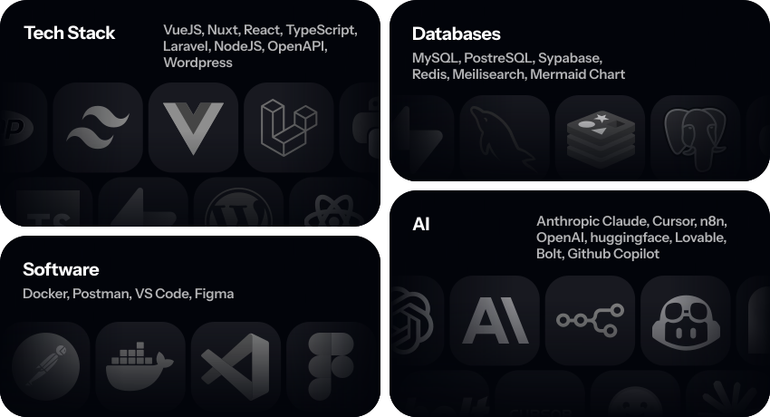

## Server provisioning and deployment

This repository now contains production bootstrap and deployment automation for:

- `vozacki.rs`
- `app.vozacki.rs`
- `api.vozacki.rs`

Stack:

- Ubuntu 22.04 LTS server bootstrap with SSH hardening, UFW, Fail2ban, Docker Engine, Docker Compose plugin
- Traefik reverse proxy with automatic Let's Encrypt certificates
- Three Docker services (currently placeholder `traefik/whoami`) routed by hostnames
- GitHub Actions for one-time bootstrap and regular deploy

## Repository structure

- `deploy/docker-compose.yml` — reverse proxy + 3 domain services
- `deploy/traefik/traefik.yml` — Traefik static config + ACME resolver
- `scripts/bootstrap-server.sh` — one-time Ubuntu hardening and Docker setup
- `scripts/deploy-remote.sh` — remote deployment update
- `.github/workflows/bootstrap-server.yml` — manual server bootstrap workflow
- `.github/workflows/deploy.yml` — deployment workflow

## Required GitHub secrets

Already available:

- `DEV_HOST`
- `DEV_USER`
- `DEV_PASSWORD`

Add:

- `DEV_SSH_PUBLIC_KEY` — public key that will be added to `~/.ssh/authorized_keys` during bootstrap
- `DEV_SSH_PRIVATE_KEY` — matching private key used by deploy workflow after password SSH is disabled
- `LETSENCRYPT_EMAIL` — email for Let's Encrypt ACME registration

## First-time setup

1. Add DNS records:
   - `A vozacki.rs -> <server_ip>`
   - `A app.vozacki.rs -> <server_ip>`
   - `A api.vozacki.rs -> <server_ip>`
   - Optional: matching `AAAA` records for IPv6
2. Run GitHub Actions workflow **Bootstrap DEV server** (`bootstrap-server.yml`) once.
3. After bootstrap, server will enforce:
   - root SSH login disabled
   - password SSH auth disabled
   - key-based SSH only
   - only ports `22`, `80`, `443` open in UFW
4. Run GitHub Actions workflow **Deploy to DEV** (`deploy.yml`) to publish containers.
   This workflow uses `DEV_SSH_PRIVATE_KEY` when present and falls back to `DEV_PASSWORD` only if key is not provided.

## Runtime behavior

- Traefik listens on `80/443`, redirects HTTP to HTTPS, and obtains certificates automatically.
- Each domain routes to its own service:
  - `vozacki.rs` -> `vozacki-rs`
  - `app.vozacki.rs` -> `app-vozacki-rs`
  - `api.vozacki.rs` -> `api-vozacki-rs`
- All services use `restart: unless-stopped` and include healthchecks.

## Replace placeholder services

Currently, each domain uses `traefik/whoami` as a stub service. Replace images and internal ports in
`deploy/docker-compose.yml` with real applications when they are ready.